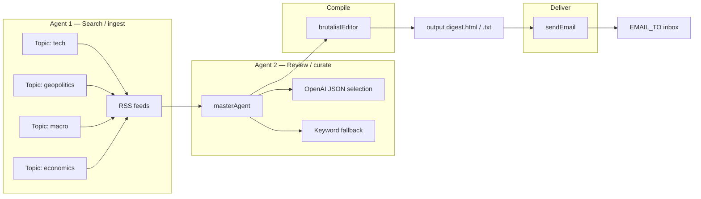

# Architecture — how the pipeline is structured

This project implements a **three-stage flow** (search → review → deliver) using small, single-purpose modules. There are no long-running “AI agents” with tools—each stage is one async function or one LLM call.

## Stage 1 — Search (news discovery)

**Role:** Pull candidate articles per pillar (tech, geopolitics, macro, economics).

| Piece | File | What it does |
|-------|------|----------------|
| Config | [`config/topicFeeds.ts`](../config/topicFeeds.ts) | Google News RSS query URLs + BBC + ZeroHedge / Naked Capitalism / Bloomberg / CNBC supplements; hostname allowlist |
| Worker | [`agents/topicAgent.ts`](../agents/topicAgent.ts) | For one topic: fetch RSS, normalize links, filter by allowed hosts, dedupe, cap list size |

All topic workers run **in parallel** (`Promise.all` in [`scripts/runPipeline.ts`](../scripts/runPipeline.ts)).

## Stage 2 — Review (curation)

**Role:** From the candidate lists, pick the best stories per topic for a macro-oriented reader.

| Piece | File | What it does |
|-------|------|----------------|
| Curator | [`agents/masterAgent.ts`](../agents/masterAgent.ts) | **With `OPENAI_API_KEY`:** one Chat Completions call returns JSON indices into each topic’s array. **Without key or on error:** deterministic keyword scoring + diversity + clickbait penalties (`fallbackCurate`). |

Optional post-step: [`agents/rssUtil.ts`](../agents/rssUtil.ts) `resolveGoogleNewsUrls` tries to replace opaque Google News links (limited by Google’s client-side redirects).

## Stage 3 — Compile (email body)

**Role:** Turn curated JSON into one HTML + one plaintext body (brutalist, monospace, human-review friendly).

| Piece | File |
|-------|------|
| [`agents/brutalistEditor.ts`](../agents/brutalistEditor.ts) | `buildBrutalistHtml`, `buildBrutalistPlain` |

## Stage 4 — Deliver (send)

**Role:** Read `output/digest.html` / `digest.txt` and send via **Resend** or **SMTP**.

| Piece | File |
|-------|------|
| [`scripts/sendEmail.ts`](../scripts/sendEmail.ts) | Loads files, sends multipart email; recipient from `EMAIL_TO` |

Run after pipeline: `npm run send` or `npm run run:all`.

## Data shapes

| File | Contents |
|------|----------|
| [`types/pipeline.ts`](../types/pipeline.ts) | Ingest & curation: `NormalizedArticle`, `TopicAgentResult`, `MasterCuratedOutput`, etc. |
| [`types/schedule.ts`](../types/schedule.ts) | Orchestration: `ScheduleDecision`, `OrchestrateMode`, `WindowCheck`, `SendHistoryRecord`, Eastern constants. |
| [`types/run.ts`](../types/run.ts) | Phase 4: `RunHistoryRecord`, `RunKind` for `data/run-history.json`. |
| [`types/agent.ts`](../types/agent.ts) | Phase 5: central agent ids and override-file shape. |
| [`types/admin.ts`](../types/admin.ts) | Phase 6: admin settings model (`data/admin-settings.json`). |
| [`types/content.ts`](../types/content.ts) | Phase 7: persisted story and digest records (`data/stories.json`, `data/digests.json`). |

See **[PHASE2_TYPES.md](./PHASE2_TYPES.md)** for how schedule types relate to `lib/schedule/*`.

## Phase 3 — Slice mode (topics only)

Optional env **`PIPELINE_SLICE=1`** limits **search + intel + editor** to **`PIPELINE_SLICE_TOPICS`** (default `tech`). Delivery is still a separate step (`npm run send` / orchestrator). See **[PHASE3_SLICE.md](./PHASE3_SLICE.md)**.

## Phase 4 — Run history & artifacts

Append-only **`data/run-history.json`**, optional copy of **`output/`** → **`data/runs/<runId>/`**, and **`PIPELINE_LOG_FORMAT=json`**. See **[PHASE4_RUN_HISTORY.md](./PHASE4_RUN_HISTORY.md)**.

## Phase 5 — Agent registry & enabled state

Agent ids are centralized in `types/agent.ts`; runtime state resolves defaults + `data/agent-registry.json` + env overrides (`AGENT_ENABLE`, `AGENT_DISABLE`). `scripts/runPipeline.ts` and `scripts/sendEmail.ts` enforce enabled checks before running stage logic.

## Phase 6 — Admin UI foundation

`npm run admin` starts a local HTTP server (`scripts/adminServer.ts`) that serves `admin/index.html` and exposes basic APIs for overview, agent toggles, runs, and settings.

## Phase 7 — Stories and digests surfaces

`scripts/runPipeline.ts` now persists flattened story rows and digest summaries from real pipeline output; admin APIs expose `/api/stories` and `/api/digests` for UI/operator use.

## Phase 8 — Safe send controls

`lib/email/sendDigest.ts` supports `SEND_MODE` (`live`, `test`, `dry-run`) and operator guardrails (`SEND_ALLOWLIST`, `SEND_REQUIRE_CONFIRM`). `send`/`orchestrate` run-history rows include `sendMode`.

## Legacy mode

`PIPELINE_MODE=regions` uses continent-based RSS + [`agents/ranker.ts`](../agents/ranker.ts) + [`agents/editor.ts`](../agents/editor.ts) instead of topics + master + brutalist editor.
